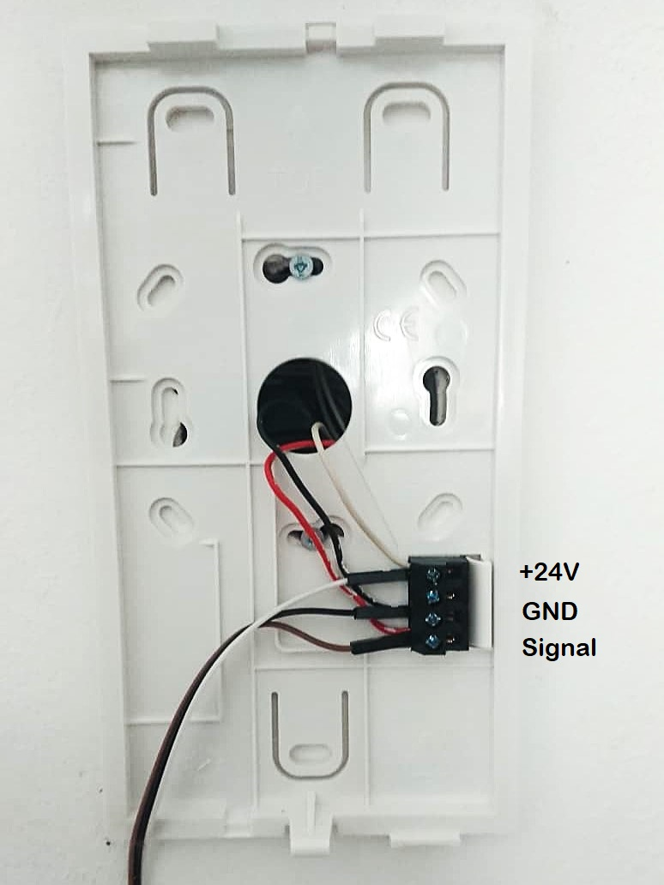
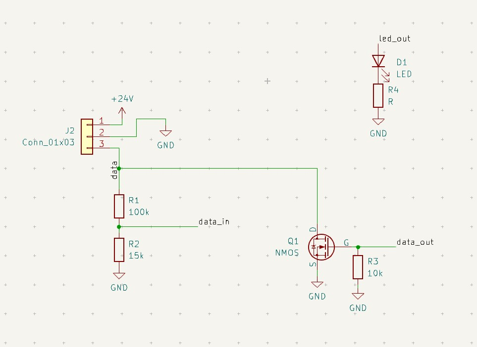
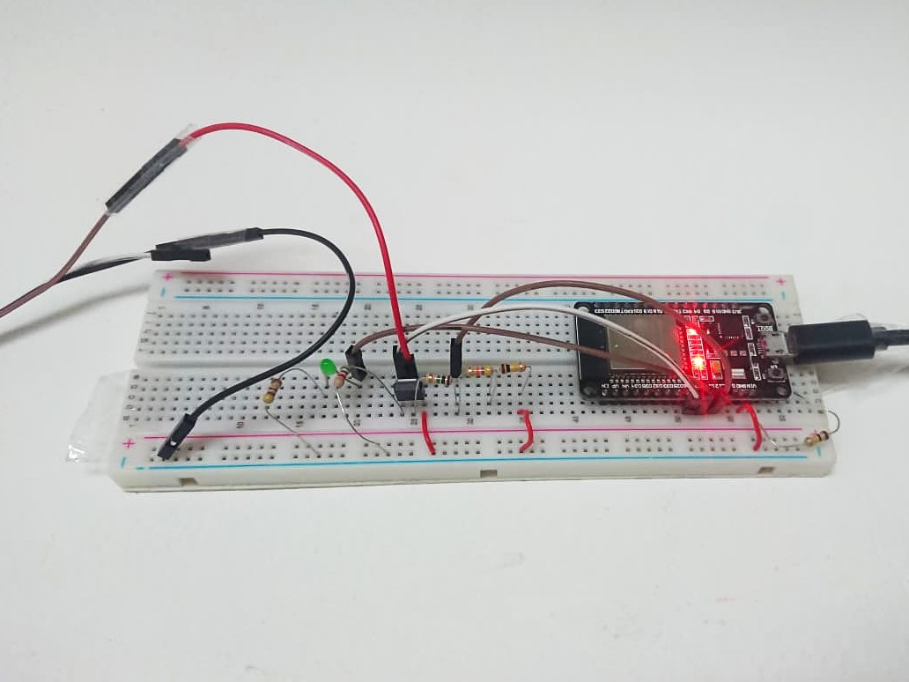

# tcs-mqtt-gateway

> **Disclaimer:** This is a personal DIY project. Use it at your own risk. The author takes no responsibility for any damage to your intercom system, your property, or anything else. Tapping into building intercom wiring may void warranties or violate tenancy agreements - check before you build.

This project connects a **TCS intercom system** (tested with ISW3030) to **MQTT** using an **ESP32**.  
TCS is a widely used German manufacturer of intercom systems in multi-apartment buildings. By integrating the system with MQTT, you can connect your doorbell to your smart-home setup.

With this project you can for example:

- Receive notifications when someone rings your doorbell  
- Open the door directly from your phone  
- Integrate your intercom into your smart-home automation  
- Monitor intercom events via MQTT

The hardware is simple. You only need an ESP32 and few additional components. The device connects directly to the intercom wiring, allowing it to listen for events and trigger actions such as opening the door.

---

## Architecture

The device is built around an **ESP32 microcontroller** and communicates via **MQTT**.

For the MQTT broker, this project uses **HiveMQ Cloud**, which offers a free tier that is more than sufficient for this use case.

On the phone am using the free app **IoT MQTT Panel** where you can configure your custom control panel. 

---

## Table of Contents

1. [Overview](#overview)
2. [Features](#features)
3. [Hardware](#hardware)
4. [TCS Bus - How It Works](#tcs-bus---how-it-works)
5. [Firmware Architecture](#firmware-architecture)
6. [MQTT Topic Reference](#mqtt-topic-reference)
7. [Configuration](#configuration)
8. [Building ](#building)
9. [Credits](#credits)
10. [License](#license)

---

## Overview

TCS intercom systems (common in German apartment buildings) communicate over a one-wire bus using a simple pulse-width-encoded protocol. This project taps into that bus with a small interface circuit, decodes every frame in real time on an ESP32, and forwards events to an MQTT broker over Wi-Fi and TLS. The same connection can be used to send commands back to the bus - including opening doors or injecting arbitrary raw frames for debugging.

---

## Features

- Your phone gets a notification (via any MQTT panel app) every time someone rings at the door
- Open the door remotely with one tap from anywhere in the world
- Double-ring auto-unlock - ring twice within 3 seconds and the door opens automatically, no phone needed
- Supports multiple doors and stairwells independently
- Enable or disable the auto-unlock remotely without touching the hardware
- Two status LEDs give visual feedback

---

## Hardware

Start by removing the front panel of the intercom station in your flat to access the wiring. The connections for my installation (TCS ISW3030) are shown in the photo below - yours may look different, so always measure with a multimeter first before connecting anything. The bus line and the supply voltage are both around 24 V.

You can find the wiring diagram for your specific model in the installation manual, for example:
[TCS ISW3030 manual (PDF)](https://www.tcsag.de/fileadmin/user_upload/PI_ISW3030-0140_5A.pdf)



### Schematic

The TCS bus runs at ~24 V, which the ESP32 cannot tolerate directly on its GPIO pins. The cleanest solution would be an optocoupler, but a simple resistor voltage divider works fine in practice and is what this build uses.

The TX side uses an N-Mosfet for pulling the bus low.



Assembled on a breadboard:



### GPIO assignment

| GPIO | Direction | Function |
|------|-----------|----------|
| 14   | Input     | TCS bus RX (via voltage divider) |
| 26   | Output    | TCS bus TX (via NPN transistor) |
| 2    | Output    | Status LED — lit when the system is enabled |
| 27   | Output    | Door-open LED — lit for 5 s after each unlock |


---

## TCS Bus - How It Works

> This section documents what was learned by sniffing the bus of a specific
> installation. The protocol appears to be proprietary and undocumented
> officially. Details may differ between hardware generations.

### Physical layer

The TCS intercom bus is a **one-wire system**. All devices on the bus share the same 3 wires. The bus is normally at a high voltage level (idle=24V). A transmitting device pulls the bus low for a defined time to encode a symbol.


### Symbol encoding

Data is encoded as **pulse widths** — the duration of each low pulse determines the meaning of the symbol:

| Symbol | Pulse width | Meaning |
|--------|-------------|---------|
| `0`-bit | 2 000 µs | Binary zero |
| `1`-bit | 4 000 µs | Binary one |
| `START` | 6 000 µs | Start of a new frame |
| `IDLE`  | > 9 000 µs      | Bus at rest / inter-frame gap |

Centre values used when transmitting: `ZERO` = 2 000 µs, `ONE` = 4 000 µs,
`START` = 6 000 µs, followed by a 10 000 µs idle gap after each frame.

### Frame structure

Every frame is transmitted **MSB-first** and has the following structure:

```
[START pulse] [length flag] [data bits] [CRC bit]
```

- **START pulse** — marks the beginning of the frame
- **Length flag** — one bit: `0` = short frame (16 data bits), `1` = long frame
  (32 data bits)
- **Data bits** — 16 or 32 bits of payload, MSB first
- **CRC bit** — single-bit checksum: running XOR of all data bits, initialised
  to `1`

All frames observed in practice are **long frames** (32-bit payload).

### Address and command encoding

The following is what was reverse-engineered from bus captures.

The 32-bit payload is structured as four bytes:

| Byte | Role | Known values |
|------|------|--------------|
| Byte 0 | Command type | `0x03` = ring event from outside station, `0x13` = door unlock command from inside station |
| Byte 1 & 2 | Apartment address | Encodes which flat is being called |
| Byte 3 | Station address | Address of the outer station where the ring was pressed |

Example frames from one installation:

| Frame value  | Meaning |
|--------------|---------|
| `0x03EAB586` | Ring from outer entrance door |
| `0x13EAB586` | Unlock outer entrance |
| `0x03EAB584` | Ring from inner entrance door |
| `0x13EAB584` | Unlock inner door |
| `0x03EA7B86` | Ring from outer entrance door other appartment |
| `0x13EA7B86` | Unlock outer door from other appartment |
| `0x03EA7B82` | Ring from inner entrance door other appartment |
| `0x13EA7B82` | Unlock inner door from other appartment|

### Double-ring auto-unlock

For convenience I implemented an auto unlock feature which sends the unlock frame when a specific doorbell is pressed twice within 3 seconds

---

## Firmware Architecture

The firmware is split into four ESP-IDF components:

```
main/
  main.c              — application logic, double-ring detection, MQTT callbacks

components/
  bus_decoder/        — GPIO ISR + FreeRTOS task that decodes incoming bus frames
  bus_writer/         — FreeRTOS task (Core 1) that transmits frames with
                        bit-accurate busy-wait timing
  mqtt_client_mod/    — thin wrapper around esp-mqtt: TLS connection, LWT,
                        publish helpers, command dispatch
  wifi_manager/       — Wi-Fi initialisation and reconnect handling
```


---

## MQTT Topic Reference

All topics are prefixed with `tcs/`.

### Subscribed (inbound commands)

| Topic | Payload | Description |
|-------|---------|-------------|
| `tcs/cmd/enable` | `true` / `1` or `false` / `0` | Enable or disable auto-unlock |
| `tcs/cmd/status` | any | Triggers a republish of the current retained state |
| `tcs/cmd/action` | see below | Send a named TCS frame onto the bus |
| `tcs/cmd/send`   | hex string, e.g. `0x13EAB586` | Inject a raw 32-bit frame |

`tcs/cmd/action` payload values:

| Value | Effect |
|-------|--------|
| `ring_outer` | Simulate outer doorbell ring |
| `ring_inner` | Simulate inner doorbell ring |
| `ring_stair_d` | Simulate stairwell D outer ring |
| `ring_stair_d_in` | Simulate stairwell D inner ring |
| `unlock_outer` | Open outer entrance |
| `unlock_inner` | Open inner door |
| `unlock_stair_d` | Open stairwell D (outer) |
| `unlock_stair_d_in` | Open stairwell D (inner) |

### Published (outbound events)

| Topic | Payload | Retained | Description |
|-------|---------|----------|-------------|
| `tcs/status/online` | `true` / `false` | yes | Device online state (also set by LWT) |
| `tcs/status/enabled` | `true` / `false` | yes | Whether auto-unlock is active |
| `tcs/event/doorbell` | `outer` / `inner` / `stairwell_d_outer` / `stairwell_d_inner` | no | First ring received (before double-ring threshold) |
| `tcs/event/unlocked` | same values as above | no | Published after a successful auto-unlock |
| `tcs/bus/rx` | hex string | no | Every frame received from the bus |
| `tcs/bus/tx` | hex string | no | Every frame sent onto the bus |
| `tcs/log` | plain text | no | Human-readable status and error messages |

---

## Configuration
### Credentials file

The MQTT broker credentials are kept out of version control. Create
`components/mqtt_client_mod/secrets.h` with the following content:

```c
#pragma once

#define BROKER_URI    "mqtts://your-broker-host:8883"
#define MQTT_USERNAME "your-username"
#define MQTT_PASSWORD "your-password"
```

The broker CA certificate is expected at
`components/mqtt_client_mod/hivemq_ca.pem` — replace this with the CA of your
own broker if you are not using HiveMQ Cloud.

### Adapting the frame codes to your installation

The bell and unlock codes are specific to each installation - you cannot use the values from this repo directly. You need to sniff your own bus first.

**How to find your codes:**

1. Flash the firmware and watch the `tcs/bus/rx` topic in your MQTT client
2. Press each doorbell button once - the received frame will appear as a hex string
3. Note down the frame value for each button
4. The corresponding unlock code is the same value with byte 0 changed from
   `0x03` to `0x13` (e.g. `0x03EAB586` → `0x13EAB586`)

Then update the constants at the top of `main/main.c`:

```c
#define TCS_FRAME_BELL_OUTER    0x03EAB586U  // ← replace with your value
#define TCS_FRAME_UNLOCK_OUTER  0x13EAB586U  // ← replace with your value
// ... and so on for each door
```

---

## Building

This project uses the standard **ESP-IDF** build system.

### Prerequisites

- [ESP-IDF](https://docs.espressif.com/projects/esp-idf/en/stable/esp32/get-started/)  v5.x installed and activated (`idf.py` on your PATH)
- An ESP32 board connected via USB
---
## Credits

This project stands on the shoulders of people who did the hard reverse-engineering work first.

**[atc1441 — TCSintercomArduino](https://github.com/atc1441/TCSintercomArduino)**
The original foundation. He was the first to reverse-engineer the TCS bus protocol and also made two great YouTube videos explaining how it works.

**[Syralist — tcs-monitor](https://github.com/Syralist/tcs-monitor)**
An MQTT monitor for the TCS bus that this project is largely based on.
Also did accompanying [blog post](https://blog.syralist.de/posts/smarthome/klingel/).

**[AzonInc — Doorman](https://github.com/AzonInc/Doorman)**
A more complete project with custom PCB, enclosure, and ESPHome firmware.

**[peteh — doorman](https://github.com/peteh/doorman)**
Another solid take on the same problem.

---

## License

This project is released under the **[The Unlicense](https://unlicense.org)** —
do whatever you want with it, no strings attached.

```
This is free and unencumbered software released into the public domain.

Anyone is free to copy, modify, publish, use, compile, sell, or distribute
this software, either in source code form or as a compiled binary, for any
purpose, commercial or non-commercial, and by any means.

In jurisdictions that recognize copyright laws, the author or authors of this
software dedicate any and all copyright interest in the software to the public
domain.

THE SOFTWARE IS PROVIDED "AS IS", WITHOUT WARRANTY OF ANY KIND.
```
